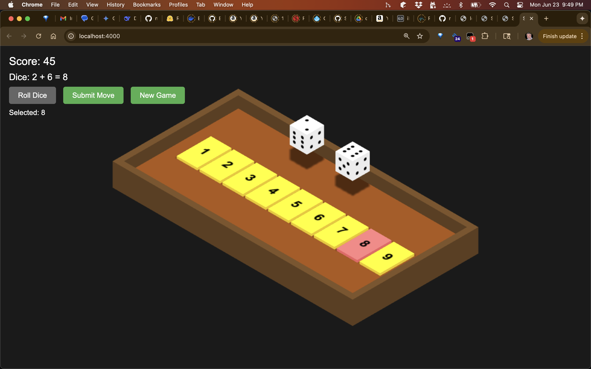

# Shut the Box - 3D WASM Game

A stunning 3D version of the classic dice game "Shut the Box" built with Rust/WASM and Three.js, featuring realistic dice physics and an isometric game board.



## How to Play

1. **Roll the Dice**: Click "Roll Dice" to roll one or two dice
2. **Select Tiles**: Click on numbered tiles that sum to your dice total
3. **Submit Move**: Click "Submit Move" to flip down the selected tiles
4. **Continue Playing**: Keep rolling and flipping tiles until no valid moves remain
5. **Win Condition**: Flip down all tiles (score of 0) to achieve a perfect game!

## Game Rules

- **Dice Rules**: When only tiles 1-6 remain up, you roll a single die; otherwise, roll two dice
- **Valid Moves**: Select any combination of upright tiles that sum exactly to your dice total
- **Scoring**: Your score is the sum of all tiles still standing at game end
- **Game Over**: The game ends when no combination of remaining tiles can match your dice roll
- **Perfect Game**: Achieve a score of 0 by flipping down all tiles

## Features

- **3D Isometric View**: Beautiful Three.js-powered 3D graphics with realistic shadows
- **Authentic Dice**: Mathematically valid dice with proper pip arrangements (opposite faces sum to 7)
- **Smooth Animations**: Dice rolling animations and tile flipping effects
- **Smart Game Logic**: Automatic detection of valid moves and game over conditions
- **Visual Feedback**: Color-coded tiles and clear game state indicators
- **Turn-Based Flow**: Proper button state management ensures correct gameplay sequence

## Building and Running

### Prerequisites
- **Rust and Cargo**: Install from [rustup.rs](https://rustup.rs/)
- **wasm-pack**: Install with `curl https://rustwasm.github.io/wasm-pack/installer/init.sh -sSf | sh`
- **basic-http-server**: Usually pre-installed with development environments

### Quick Start
1. **Build the project**:
   ```bash
   ./build.sh
   ```

2. **Run the game** (starts server and opens browser):
   ```bash
   ./run.sh
   ```

That's it! The game will automatically open in your browser.

### Alternative Serving
You can also use any static file server:
```bash
# Using basic-http-server directly
basic-http-server www

# Using Python
python -m http.server 4000 --directory www

# Using Node.js
npx serve www -p 4000
```

## Technical Architecture

- **Game Logic**: Rust with wasm-bindgen for high-performance, memory-safe game rules
- **3D Graphics**: Three.js for WebGL-powered 3D rendering and animations  
- **Interface**: Modern HTML5/CSS3/JavaScript with responsive design
- **Build System**: wasm-pack for seamless Rust-to-WebAssembly compilation
- **Performance**: WebAssembly ensures near-native speed for game calculations

## Game Strategy Tips

- **Early Game**: Focus on flipping high-value tiles (7, 8, 9) when possible
- **Mid Game**: Look for combinations that use multiple tiles efficiently
- **End Game**: With fewer tiles remaining, you'll roll a single die - plan accordingly
- **Perfect Score**: Requires both skill and luck - aim to shut all boxes for ultimate bragging rights!