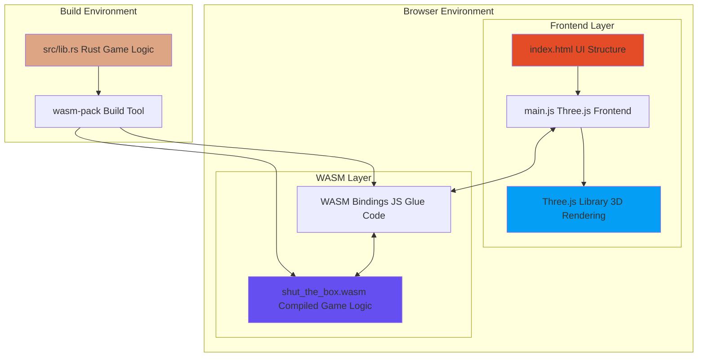
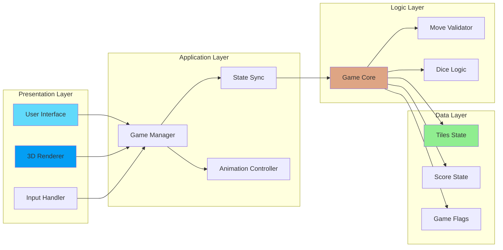
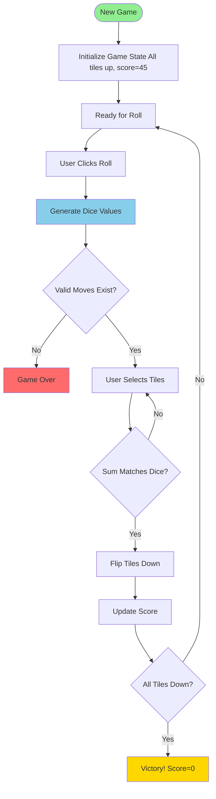
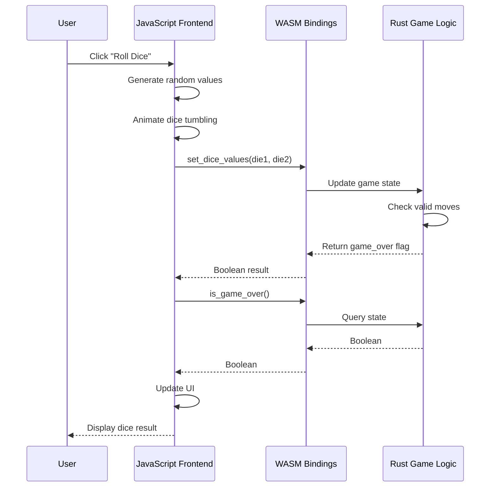
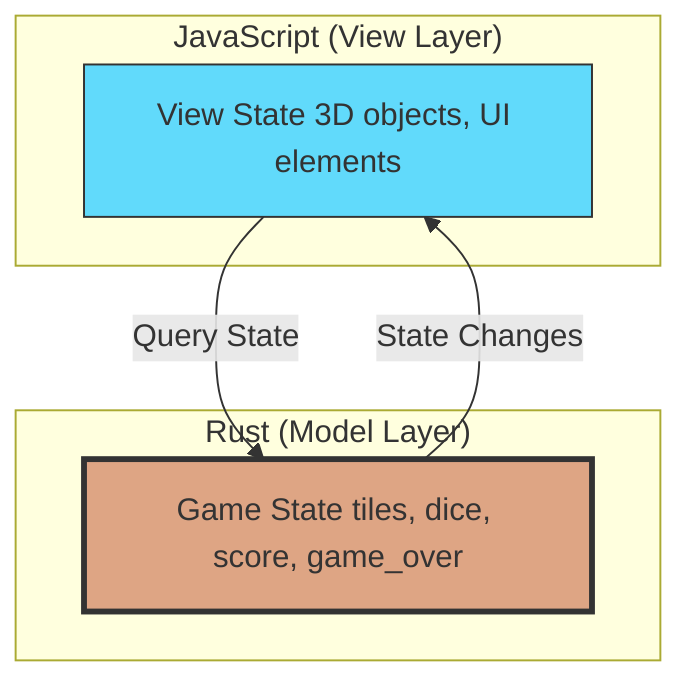
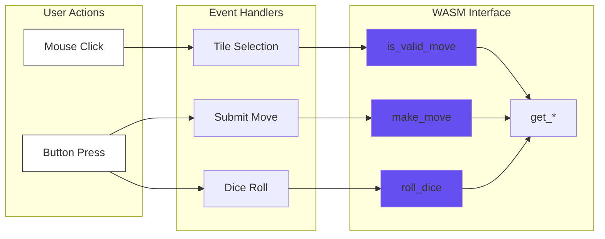
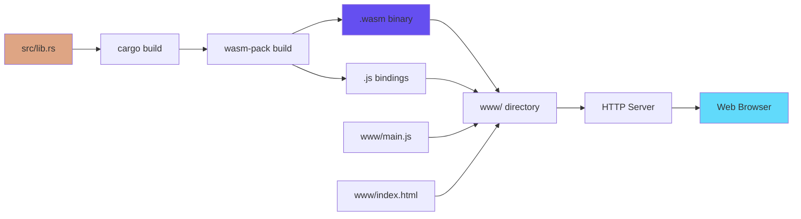

# System Architecture

This page provides a comprehensive overview of the Shut the Box system architecture, including component relationships, data flows, and key design decisions.

## High-Level Architecture



## Component Architecture

### Layer Breakdown



## Component Responsibilities

### Frontend Components (JavaScript/Three.js)

| Component | File | Responsibility |
|-----------|------|----------------|
| **Scene Manager** | main.js:10-65 | Initialize Three.js scene, camera, renderer, lighting |
| **Board Creator** | main.js:67-103 | Create 3D game board and edges |
| **Tile Manager** | main.js:105-148 | Generate and manage 9 numbered tiles with textures |
| **Dice System** | main.js:150-318 | Create dice, paint faces, detect top values |
| **Input Handler** | main.js:320-342 | Process mouse clicks and tile selection |
| **Animation Engine** | main.js:486-545 | Dice rolling and tile flipping animations |
| **UI Controller** | main.js:623-647 | Update score, messages, button states |

### Backend Components (Rust/WASM)

| Component | File | Responsibility |
|-----------|------|----------------|
| **Game Struct** | lib.rs:4-11 | Core game state container |
| **Game Logic** | lib.rs:20-149 | Public API for game operations |
| **Move Validator** | lib.rs:76-91 | Validate tile selection combinations |
| **Combination Checker** | lib.rs:188-203 | Recursive algorithm for valid moves |
| **Dice Controller** | lib.rs:32-65 | Roll dice, manage single/double die mode |
| **State Manager** | lib.rs:143-149 | Reset and state transitions |

## Data Flow Architecture

### Game State Flow



### WASM Communication Flow



## Architecture Patterns

### State Management Pattern

The application uses a **single source of truth** pattern where all game state resides in Rust:



**Benefits:**
- Consistent game rules enforcement
- Testable business logic
- Type-safe state transitions
- No sync issues between layers

### Component Communication



## Key Design Decisions

### 1. Rust for Game Logic

**Rationale:**
- Type safety prevents invalid game states
- Memory safety without garbage collection
- Excellent performance for combination checking
- Compiles to compact WASM

### 2. Three.js for 3D Rendering

**Rationale:**
- Mature WebGL abstraction
- Rich ecosystem of helpers
- Orthographic camera for isometric view
- Built-in shadow mapping

### 3. Isometric Camera View

```
Camera Configuration:
- Type: OrthographicCamera
- Position: (10, 10, 10)
- Look At: (0, 0, 0)
- Frustum: 20 units
```

**Benefits:**
- No perspective distortion
- Clear view of all tiles
- Predictable raycasting for clicks

### 4. State-Driven UI Updates

All UI updates derive from WASM state queries:

```javascript
function updateUI() {
    const score = game.get_score();      // Query WASM
    const isOver = game.is_game_over();  // Query WASM

    // UI reflects authoritative state
    document.getElementById('score').textContent = `Score: ${score}`;
    document.getElementById('roll-btn').disabled = isOver;
}
```

### 5. Recursive Combination Checking

The move validator uses a recursive algorithm to check all possible tile combinations:

```
Algorithm: check_combinations(tiles, size, target)
- Base case: size==0, return target==0
- Recursive cases:
  1. Include first tile
  2. Exclude first tile
- Time complexity: O(2^n) worst case
- Acceptable for n≤9 tiles
```

## Performance Characteristics

| Operation | Complexity | Notes |
|-----------|-----------|-------|
| Roll Dice | O(1) | Random number generation |
| Validate Move | O(2^n) | Recursive combination check, n≤9 |
| Flip Tile | O(1) | Array update |
| Calculate Score | O(n) | Sum remaining tiles |
| Render Frame | O(m) | m = number of 3D objects (~30) |

## Build Pipeline



## Security Considerations

1. **Input Validation**: All user inputs validated in Rust
2. **No Direct DOM Manipulation from WASM**: Clean separation of concerns
3. **Type Safety**: Rust prevents memory corruption
4. **Bounds Checking**: Array access always validated
5. **No Unsafe Code**: Entire codebase is safe Rust

## Scalability

Current architecture supports:
- **Tiles**: Fixed at 9 (game rule)
- **Concurrent Games**: Unlimited (each browser instance independent)
- **State Size**: ~100 bytes per game
- **WASM Bundle**: ~20KB (gzipped)

---

**Related Pages:**
- [Game Logic Details](Game-Logic)
- [Frontend Implementation](Frontend-3D)
- [Sequence Diagrams](Sequence-Diagrams)
