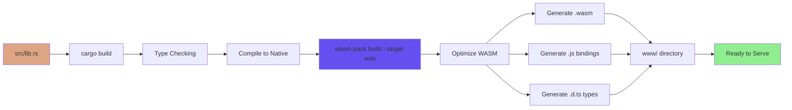
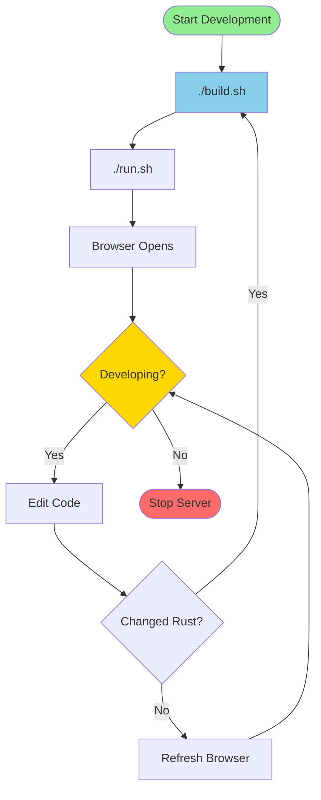
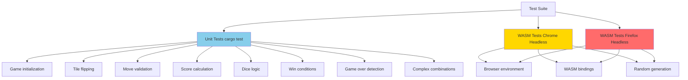
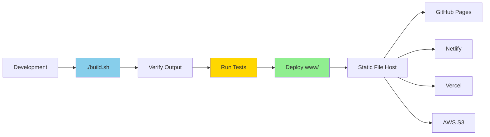

# Build and Development

This page documents the build process, development workflow, testing procedures, and deployment for the Shut the Box project.

## Prerequisites

### Required Tools

| Tool | Version | Purpose |
|------|---------|---------|
| **Rust** | Latest stable | Core language for game logic |
| **wasm-pack** | Latest | Compile Rust to WebAssembly |
| **Cargo** | Latest (with Rust) | Rust package manager |
| **basic-http-server** | Any | Development web server |
| **Web Browser** | Modern | Chrome, Firefox, Safari, Edge |

### Installation

```bash
# Install Rust and Cargo
curl --proto '=https' --tlsv1.2 -sSf https://sh.rustup.rs | sh

# Install wasm-pack
curl https://rustwasm.github.io/wasm-pack/installer/init.sh -sSf | sh

# Install basic-http-server
cargo install basic-http-server

# Verify installations
rustc --version
cargo --version
wasm-pack --version
basic-http-server --version
```

---

## Build Process

### Build Pipeline



### Build Script

**File:** `build.sh`

```bash
#!/bin/bash
wasm-pack build --target web
```

**Usage:**
```bash
./build.sh
```

**What it does:**
1. Compiles Rust code in `src/` to WebAssembly
2. Generates JavaScript bindings
3. Generates TypeScript definitions
4. Outputs to `www/` directory:
   - `shut_the_box_bg.wasm` - WebAssembly binary
   - `shut_the_box.js` - JavaScript bindings
   - `shut_the_box.d.ts` - TypeScript definitions

**Build Flags:**
- `--target web` - Browser-compatible ES modules
- Default optimization level (release mode)

---

## Development Workflow

### Local Development



### Run Script

**File:** `run.sh`

```bash
#!/bin/bash
basic-http-server www -a 127.0.0.1:4000 &
SERVER_PID=$!
sleep 1

# Try opening browser
if command -v xdg-open > /dev/null; then
    xdg-open http://127.0.0.1:4000
elif command -v open > /dev/null; then
    open http://127.0.0.1:4000
else
    echo "Server running at http://127.0.0.1:4000"
fi

wait $SERVER_PID
```

**Usage:**
```bash
./run.sh
```

**What it does:**
1. Starts HTTP server on port 4000
2. Serves files from `www/` directory
3. Opens browser automatically
4. Waits for Ctrl+C to stop

### Alternative Serving Methods

```bash
# Using basic-http-server directly
basic-http-server www

# Using Python's http.server
python -m http.server 4000 --directory www

# Using Python 2
cd www && python -m SimpleHTTPServer 4000
```

---

## Testing

### Test Structure



### Running Tests

#### Rust Unit Tests

```bash
cargo test
```

**Output:**
```
running 11 tests
test tests::test_new_game ... ok
test tests::test_default ... ok
test tests::test_flip_tile ... ok
test tests::test_valid_moves ... ok
test tests::test_make_move ... ok
test tests::test_win_condition ... ok
test tests::test_dice_logic ... ok
test tests::test_game_over_detection ... ok
test tests::test_reset ... ok
test tests::test_score_calculation ... ok
test tests::test_complex_combinations ... ok

test result: ok. 11 passed; 0 failed; 0 finished
```

**Location:** `src/lib.rs:213-392`

#### WASM Browser Tests

```bash
# Chrome headless
wasm-pack test --chrome --headless

# Firefox headless
wasm-pack test --firefox --headless

# With output
wasm-pack test --chrome --headless -- --nocapture
```

**Output:**
```
running 3 tests
test tests::test_new_game ... ok
test tests::test_default ... ok
test tests::test_make_move ... ok

test result: ok. 3 passed; 0 failed; 0 finished
```

**What's tested:**
- WASM module loading
- JavaScript bindings
- Browser-specific randomness (getrandom)
- Cross-compilation correctness

### Test Coverage

| Component | Unit Tests | WASM Tests | Coverage |
|-----------|-----------|------------|----------|
| Game initialization | ✓ | ✓ | 100% |
| Tile management | ✓ | - | 100% |
| Move validation | ✓ | - | 100% |
| Move execution | ✓ | ✓ | 100% |
| Score calculation | ✓ | - | 100% |
| Dice rolling | ✓ | - | 100% |
| Win detection | ✓ | - | 100% |
| Game over detection | ✓ | - | 100% |
| Reset functionality | ✓ | - | 100% |
| Complex combinations | ✓ | - | 100% |
| WASM bindings | - | ✓ | 100% |

---

## Project Structure

```
shut_the_box/
│
├── src/
│   └── lib.rs                  # Rust game logic (404 lines)
│       ├── Game struct         # State container
│       ├── Public API          # WASM-exposed methods
│       ├── Private methods     # Internal logic
│       └── Tests               # Unit & WASM tests
│
├── www/
│   ├── index.html             # HTML structure (268 lines)
│   ├── main.js                # Three.js frontend (749 lines)
│   ├── shut_the_box.wasm      # Generated WASM binary
│   ├── shut_the_box.js        # Generated JS bindings
│   └── shut_the_box.d.ts      # Generated TypeScript defs
│
├── build.sh                   # Build script
├── run.sh                     # Development server script
├── Cargo.toml                 # Rust dependencies
├── Cargo.lock                 # Locked dependency versions
├── .gitignore                 # Git ignore rules
├── CLAUDE.md                  # Developer guidance
└── README.md                  # Project readme
```

### Generated Files

**Do NOT edit these files (auto-generated by wasm-pack):**
- `www/shut_the_box.wasm`
- `www/shut_the_box.js`
- `www/shut_the_box.d.ts`
- `www/shut_the_box_bg.wasm.d.ts`

---

## Dependencies

### Rust Dependencies

**File:** `Cargo.toml`

```toml
[package]
name = "shut_the_box"
version = "0.1.0"
edition = "2021"

[lib]
crate-type = ["cdylib"]

[dependencies]
wasm-bindgen = "0.2"
rand = { version = "0.8", features = ["getrandom"] }
getrandom = { version = "0.2", features = ["js"] }
web-sys = { version = "0.3", features = ["console"] }

[dev-dependencies]
wasm-bindgen-test = "0.3"
```

**Key Dependencies:**

| Crate | Version | Purpose |
|-------|---------|---------|
| `wasm-bindgen` | 0.2 | Rust ↔ JavaScript bindings |
| `rand` | 0.8 | Random number generation |
| `getrandom` | 0.2 | Browser-compatible RNG (js feature) |
| `web-sys` | 0.3 | Web API bindings (console logging) |
| `wasm-bindgen-test` | 0.3 | WASM testing framework |

### Frontend Dependencies

**Loaded via CDN in `index.html`:**

```html
<script src="https://cdnjs.cloudflare.com/ajax/libs/three.js/r128/three.min.js"></script>
```

**Version:** Three.js r128

**Why CDN?**
- No npm/node_modules needed
- Faster initial setup
- Widely cached by browsers
- Simple dependency management

---

## Build Optimization

### Release vs Debug Builds

```bash
# Debug build (faster compilation, larger binary)
wasm-pack build --target web --dev

# Release build (default, slower compilation, smaller binary)
wasm-pack build --target web
```

### Binary Size

| Build Type | WASM Size | Notes |
|------------|-----------|-------|
| Debug | ~150 KB | Includes debug symbols |
| Release | ~20 KB | Optimized, stripped |
| Release (gzipped) | ~8 KB | Over-the-wire size |

### Optimization Flags

Default `Cargo.toml` optimizations:
```toml
[profile.release]
opt-level = "z"  # Optimize for size
lto = true       # Link-time optimization
codegen-units = 1 # Better optimization
```

---

## Debugging

### Browser DevTools

**JavaScript Console:**
```javascript
// Inspect game state
game.get_tiles()      // [1, 1, 1, 0, 0, 0, 1, 1, 1]
game.get_score()      // 24
game.is_game_over()   // false
game.get_current_sum() // 7
```

**Three.js Debugging:**
```javascript
// Access global variables (in console)
scene       // THREE.Scene object
camera      // Camera object
tiles       // Array of tile meshes
dice        // Array of die meshes
```

### Rust Debugging

**Console Logging:**
```rust
#[wasm_bindgen(start)]
pub fn main() {
    web_sys::console::log_1(&"Message".into());
}
```

**Test Output:**
```bash
# Show test output
cargo test -- --nocapture

# Run specific test
cargo test test_dice_logic -- --nocapture
```

---

## Deployment

### Production Build



### Deployment Checklist

- [ ] Run `./build.sh` to generate fresh WASM
- [ ] Run `cargo test` - all tests pass
- [ ] Run `wasm-pack test --chrome --headless` - all tests pass
- [ ] Test in browser manually
- [ ] Verify WASM files in `www/` directory
- [ ] Deploy entire `www/` directory to static host
- [ ] Test deployed version in production

### Static Hosting Options

#### GitHub Pages

```bash
# Push www/ to gh-pages branch
git subtree push --prefix www origin gh-pages
```

#### Netlify

```bash
# netlify.toml
[build]
  publish = "www"

# Deploy
netlify deploy --prod
```

#### Vercel

```bash
# vercel.json
{
  "version": 2,
  "routes": [
    { "src": "/(.*)", "dest": "/www/$1" }
  ]
}

# Deploy
vercel --prod
```

---

## Performance Monitoring

### WASM Performance

```javascript
// Measure WASM call performance
console.time('roll_dice');
game.roll_dice();
console.timeEnd('roll_dice');
// Typical: < 1ms

console.time('is_valid_move');
game.is_valid_move([1, 2, 3, 4, 5]);
console.timeEnd('is_valid_move');
// Typical: < 0.1ms
```

### Rendering Performance

```javascript
// Monitor FPS
const stats = new Stats();
document.body.appendChild(stats.dom);

function animate() {
    stats.begin();
    renderer.render(scene, camera);
    stats.end();
}
```

**Expected Performance:**
- **FPS:** 60 fps (locked to display refresh)
- **Frame time:** ~16ms
- **WASM calls:** < 1ms each

---

## Common Issues

### Build Fails

**Problem:** `wasm-pack` not found
```bash
# Solution: Install wasm-pack
curl https://rustwasm.github.io/wasm-pack/installer/init.sh -sSf | sh
```

**Problem:** Rust version too old
```bash
# Solution: Update Rust
rustup update stable
```

### Server Won't Start

**Problem:** Port 4000 already in use
```bash
# Solution: Use different port
basic-http-server www -a 127.0.0.1:8080
```

**Problem:** `basic-http-server` not found
```bash
# Solution: Install it
cargo install basic-http-server
```

### WASM Not Loading

**Problem:** CORS errors in browser console

**Solution:** Must use HTTP server, not `file://` protocol
```bash
# Don't: Double-click index.html
# Do: Use HTTP server
./run.sh
```

### Tests Hanging

**Problem:** WASM tests hang in headless browser

**Solution:** Already fixed in code with test environment detection
```javascript
function isTestEnvironment() {
    return navigator.webdriver === true ||
           window.navigator.userAgent.includes('HeadlessChrome');
}
```

---

## Development Tips

### Rapid Iteration

1. **Keep server running:** No need to restart for HTML/JS changes
2. **Rebuild WASM only when needed:** Only run `./build.sh` after Rust changes
3. **Use browser DevTools:** Inspect game state in real-time
4. **Test incrementally:** Run `cargo test` after each change

### Code Organization

- **Game logic:** Keep all rules in Rust (`src/lib.rs`)
- **Presentation:** Keep all 3D rendering in JavaScript (`www/main.js`)
- **Separation:** WASM handles state, JavaScript handles view

### Best Practices

1. **Test first:** Write tests before implementing features
2. **Small commits:** Commit working increments
3. **Document changes:** Update CLAUDE.md when architecture changes
4. **Verify WASM:** Always test in browser after Rust changes

---

**Related Pages:**
- [Architecture Overview](Architecture)
- [Game Logic Details](Game-Logic)
- [Frontend Implementation](Frontend-3D)
