# 3D Frontend (Three.js)

This page documents the Three.js-based frontend implementation, including 3D rendering, animations, and user interaction handling.

## Overview

The frontend is implemented in `www/main.js` using Three.js for WebGL rendering. It creates an isometric 3D view of the game board with interactive tiles and animated dice.

## Scene Architecture

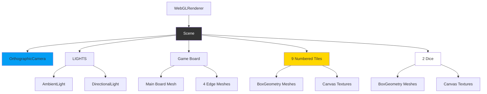

## 3D Components

### Scene Setup

**Location:** `www/main.js:10-65`

```javascript
function initThreeJS() {
    scene = new THREE.Scene();
    scene.background = new THREE.Color(0x1a1a1a);

    // Isometric camera
    camera = new THREE.OrthographicCamera(...);
    camera.position.set(10, 10, 10);
    camera.lookAt(0, 0, 0);

    // Renderer with shadows
    renderer = new THREE.WebGLRenderer({ antialias: true });
    renderer.shadowMap.enabled = true;
    renderer.shadowMap.type = THREE.PCFSoftShadowMap;
}
```

**Camera Configuration:**
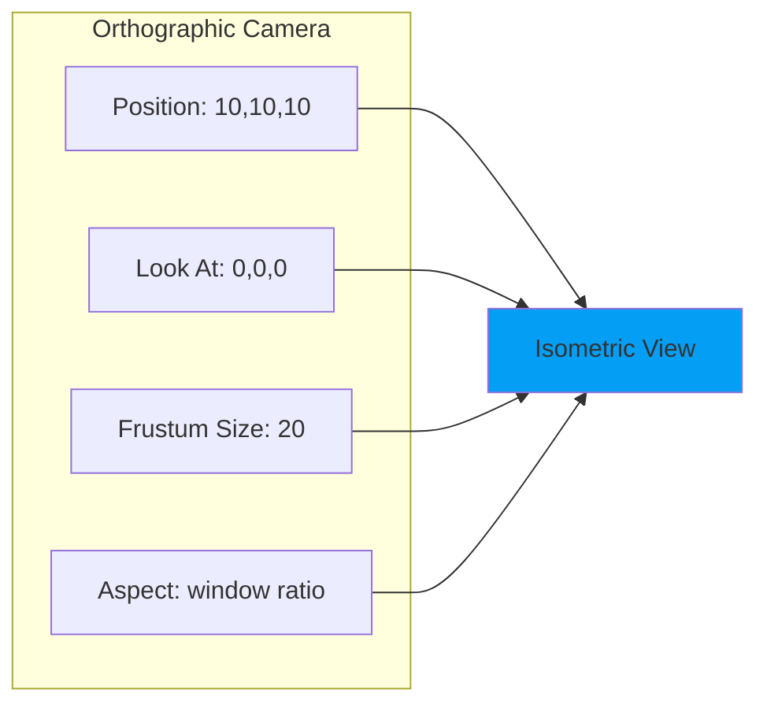

**Why Orthographic?**
- No perspective distortion
- Consistent tile sizes regardless of depth
- Clear isometric view
- Predictable raycasting for mouse clicks

---

### Lighting System

**Location:** `www/main.js:36-49`

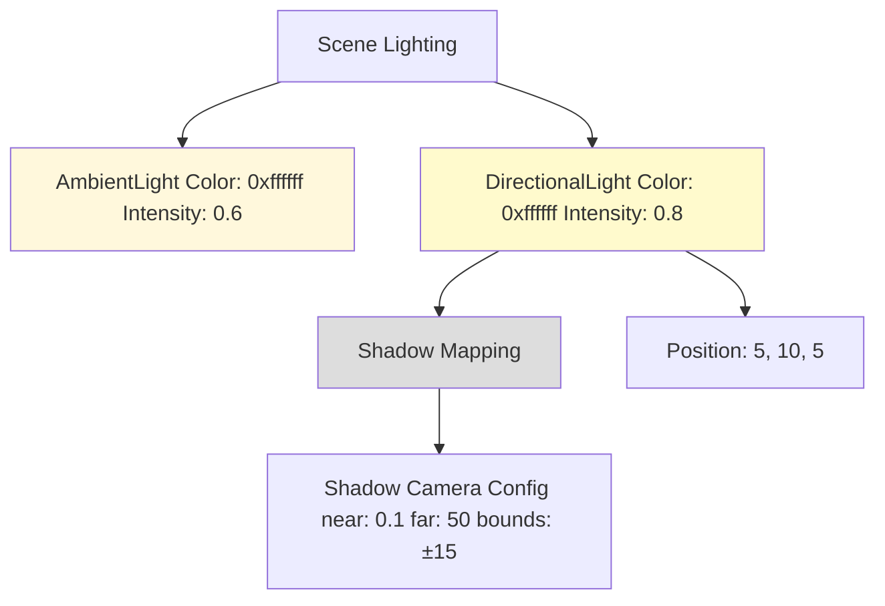

**Shadow Configuration:**
- **Type:** PCFSoftShadowMap (smooth edges)
- **Casters:** Tiles and dice cast shadows
- **Receivers:** Board receives shadows

---

### Game Board

**Location:** `www/main.js:67-103`

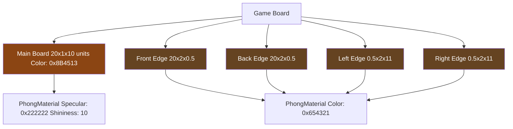

**Dimensions:**
- Main board: 20 × 1 × 10 units
- Position: Y = -0.5 (centered at origin)
- Material: Phong (realistic shading)

---

### Tile System

**Location:** `www/main.js:105-148`

#### Tile Creation

Each tile is a 3D object with:
- **Geometry:** BoxGeometry (1.8 × 0.2 × 3 units)
- **Material:** PhongMaterial (gold color: 0xffd700)
- **Number:** Canvas texture rendered on top face
- **Position:** Evenly spaced along X-axis
- **User Data:** `{tileNumber, isUp}`

**Tile Layout:**
```
Tile:  1    2    3    4    5    6    7    8    9
X pos: -8   -6   -4   -2    0    2    4    6    8
Y pos: 0.1  0.1  0.1  0.1  0.1  0.1  0.1  0.1  0.1
```

#### Number Rendering

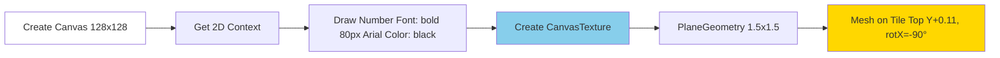

**Code Pattern:**
```javascript
const canvas = document.createElement('canvas');
const ctx = canvas.getContext('2d');
ctx.fillStyle = '#000';
ctx.font = 'bold 80px Arial';
ctx.fillText(i + 1, 64, 64);
const texture = new THREE.CanvasTexture(canvas);
```

#### Tile States

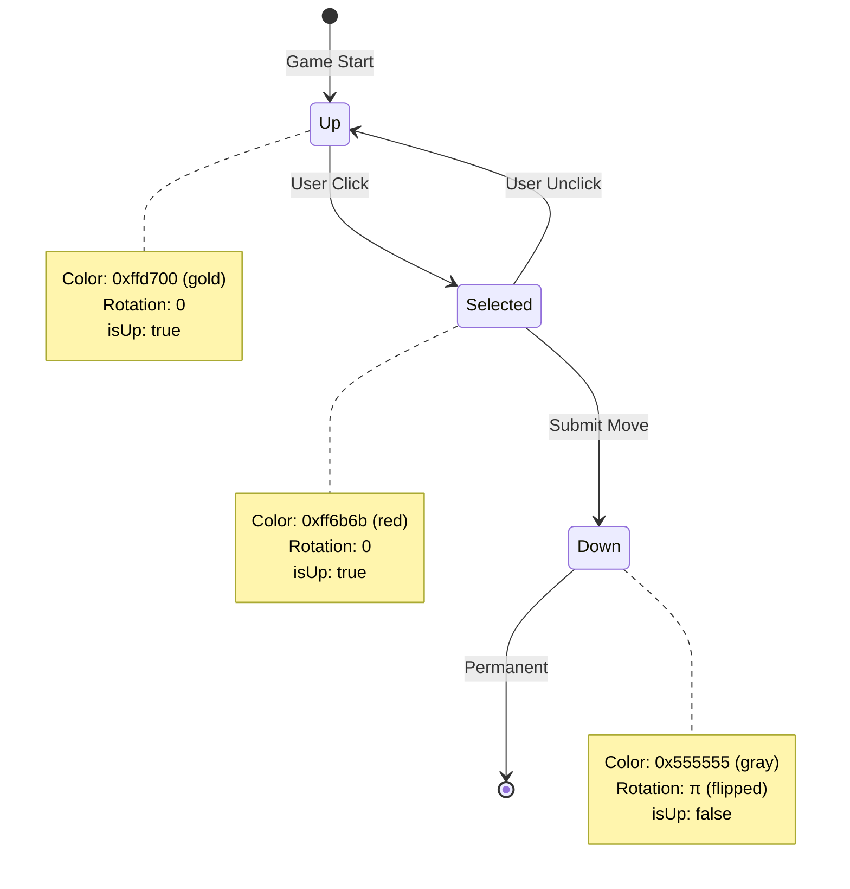

---

### Dice System

**Location:** `www/main.js:150-318`

#### Dice Structure

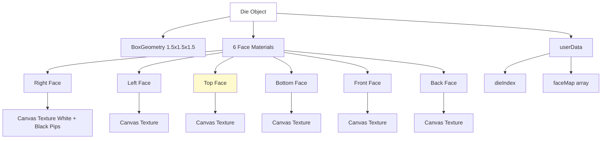

#### Face Painting Algorithm

**Location:** `www/main.js:169-242`

```mermaid
flowchart TD
    START[paintDieFaces target_value] --> OPPOSITE[Calculate Opposite opposite = 7 - target]
    OPPOSITE --> REMAIN[Get Remaining Values filter out target & opposite]
    REMAIN --> RAND_FRONT[Random Front Value from remaining]
    RAND_FRONT --> CALC_BACK[Calculate Back back = 7 - front]
    CALC_BACK --> FINAL[Remaining 2 Values for Right & Left]
    FINAL --> ASSIGN[Assign Face Array [R,L,T,B,F,K]]
    ASSIGN --> RENDER[Render Each Face Canvas + Pips]
    RENDER --> UPDATE[Update Die Materials]

    style START fill:#87ceeb
    style ASSIGN fill:#ffd700
    style UPDATE fill:#90ee90
```

**Die Face Rule:** Opposite faces always sum to 7
- Top + Bottom = 7
- Front + Back = 7
- Right + Left = 7

#### Pip Rendering Patterns

**Location:** `www/main.js:244-318`

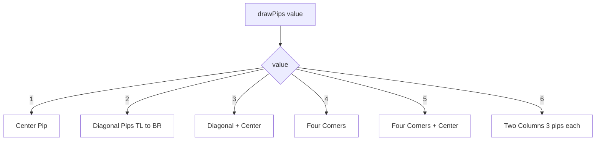

**Pip Rendering:**
- Canvas size: 256×256 pixels
- Pip radius: 20 pixels
- Pip color: Black (#000000)
- Background: White (#ffffff)

---

## User Interaction

### Mouse Click Handling

**Location:** `www/main.js:320-342`

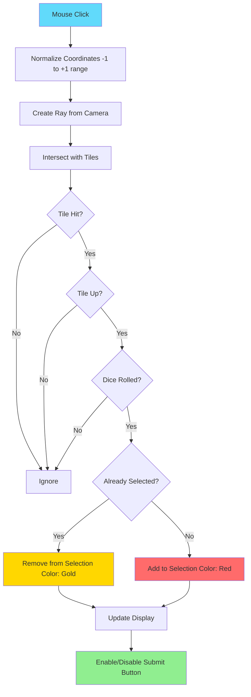

**Raycasting Process:**
```javascript
raycaster.setFromCamera(mouse, camera);
const intersects = raycaster.intersectObjects(tiles);

if (intersects.length > 0) {
    const clickedTile = intersects[0].object;
    // Handle selection
}
```

---

## Animation System

### Dice Roll Animation

**Location:** `www/main.js:474-545`

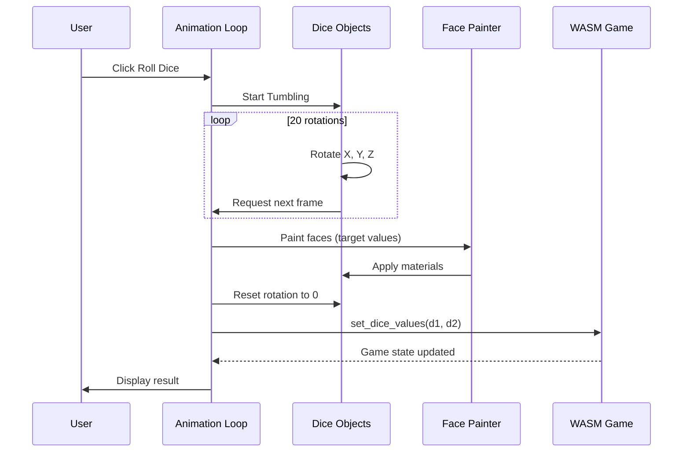

**Animation Parameters:**
- Total rotations: 20 frames
- Rotation speeds: X+0.3, Y+0.4, Z+0.2
- Final rotation: (0, 0, 0) for clear top view
- Visibility: Die 2 hidden in single-die mode

### Tile Flip Animation

**Location:** `www/main.js:556-580`

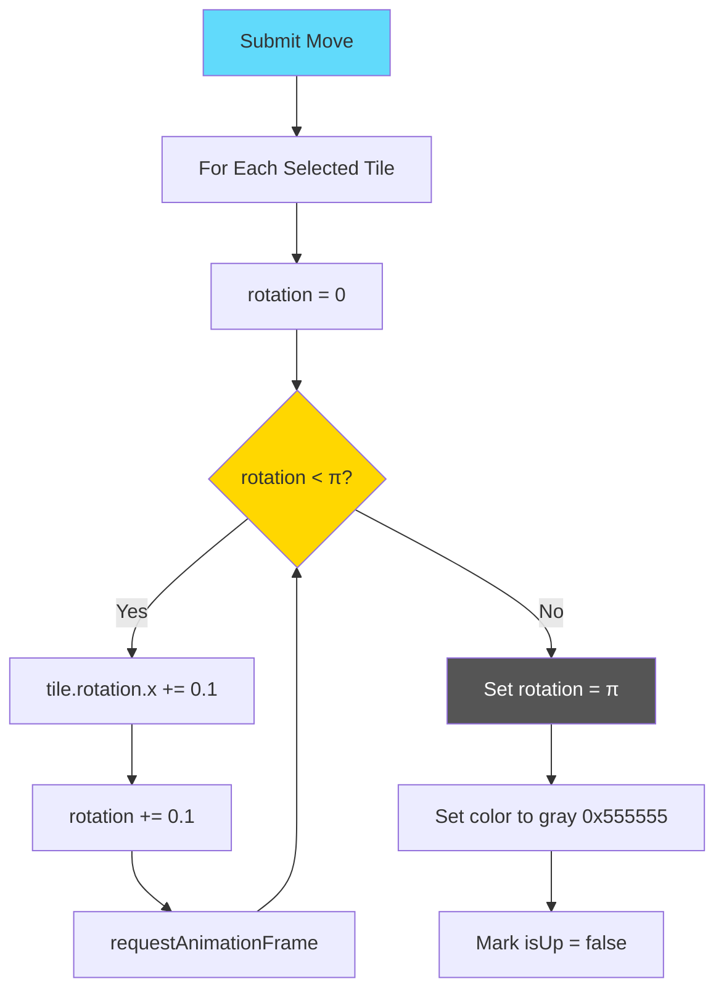

**Animation Flow:**
1. Increment rotation by 0.1 radians per frame
2. Continue until rotation ≥ π (180°)
3. Set final rotation to exactly π
4. Change color to gray (0x555555)
5. Mark tile as down

---

## UI Management

### State Display Updates

**Location:** `www/main.js:623-647`

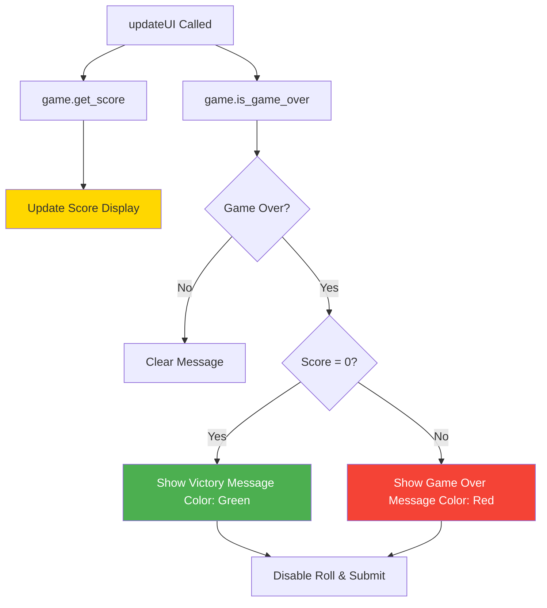

**Messages:**
- **Victory:** "🎉 Congratulations! You shut the box! Perfect score!"
- **Game Over:** "💀 Game Over! No valid moves available. Final score: {score}"

### Button State Management

| Button | Enabled When | Disabled When |
|--------|--------------|---------------|
| Roll Dice | No dice rolled & game not over | Dice already rolled OR game over |
| Submit Move | Valid selection made | No selection OR invalid sum OR game over |
| Reset | Always enabled | Never |

**Logic Flow:**
```javascript
document.getElementById('roll-btn').disabled =
    game.is_game_over() || game.get_current_sum() > 0;

document.getElementById('submit-btn').disabled =
    selectedTiles.size === 0 ||
    sum !== game.get_current_sum() ||
    game.is_game_over();
```

---

## Responsive Design

### Window Resize Handling

**Location:** `www/main.js:649-660`

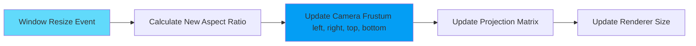

**Calculation:**
```javascript
const aspect = window.innerWidth / window.innerHeight;
camera.left = frustumSize * aspect / -2;
camera.right = frustumSize * aspect / 2;
camera.updateProjectionMatrix();
renderer.setSize(window.innerWidth, window.innerHeight);
```

---

## Splash Screen & Instructions

**Location:** `www/main.js:667-749`

### Splash Screen Flow

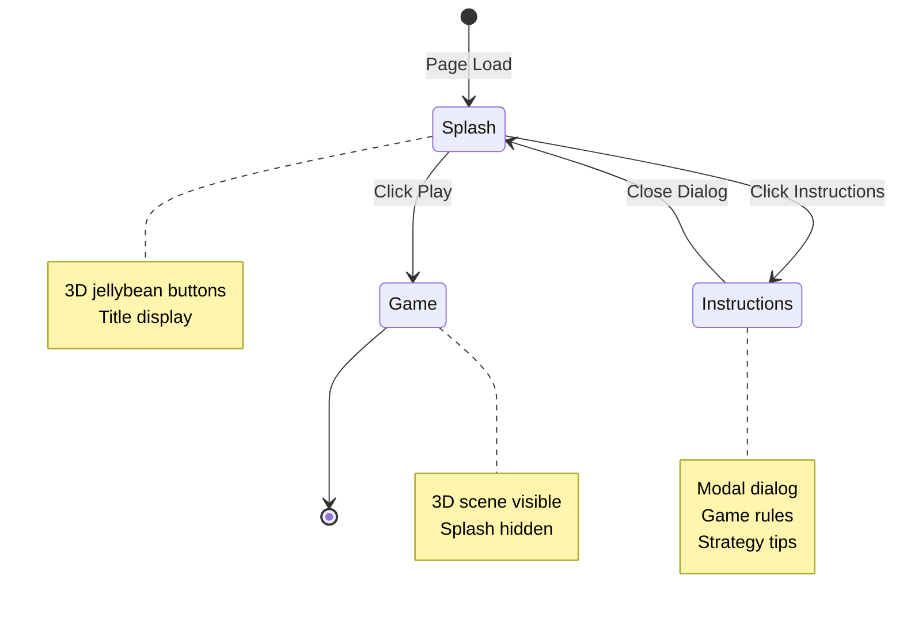

### Test Environment Detection

**Location:** `www/main.js:686-697`

```javascript
function isTestEnvironment() {
    return typeof window !== 'undefined' && (
        window.location.href.includes('wasm-bindgen-test') ||
        window.__wbindgen_test_unstable ||
        document.title.includes('wasm-bindgen test runner') ||
        navigator.webdriver === true ||
        window.navigator.userAgent.includes('HeadlessChrome')
    );
}
```

**Purpose:** Skip splash screen in automated tests to prevent timeouts

---

## Performance Optimizations

### Rendering

- **Shadow maps:** Limited to 15×15 unit area
- **Antialias:** Enabled for smooth edges
- **Material reuse:** Single material per tile type
- **Texture caching:** Canvas textures generated once

### Animation

- **requestAnimationFrame:** Browser-optimized timing
- **Limited rotations:** 20 frames for dice roll
- **Incremental updates:** 0.1 radian steps for tile flip

### Event Handling

- **Raycasting:** Only on click, not mousemove
- **Intersection:** Only with tiles array (9 objects)
- **Debouncing:** Browser handles via RAF

---

**Related Pages:**
- [Game Logic Details](Game-Logic)
- [Sequence Diagrams](Sequence-Diagrams)
- [Architecture Overview](Architecture)
