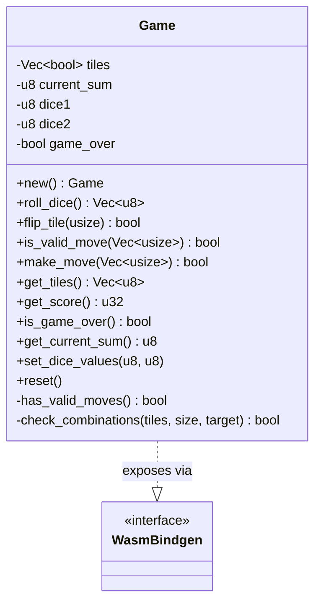
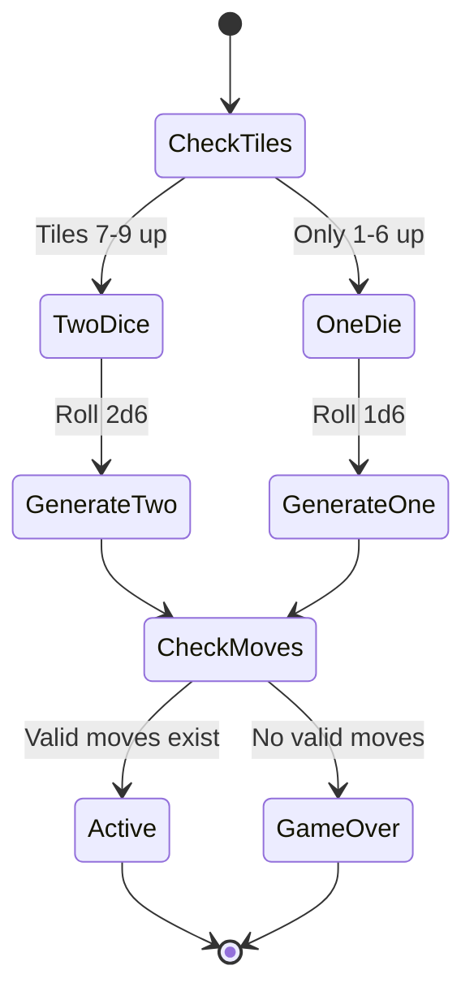
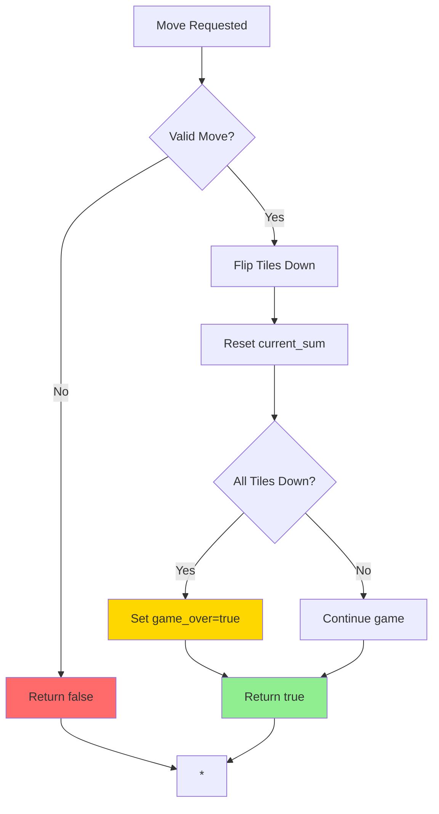
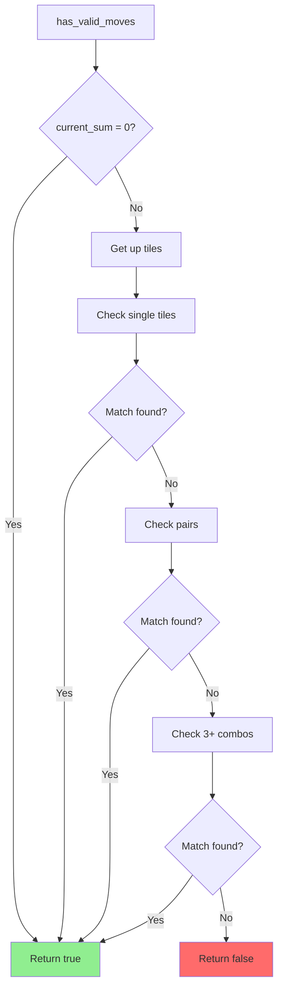

# Game Logic (Rust/WASM)

This page documents the core game logic implementation in Rust, which compiles to WebAssembly for use in the browser.

## Overview

The game logic is implemented in `src/lib.rs` as a single `Game` struct with complete state management and rule enforcement. All game rules are implemented in Rust to ensure consistency and type safety.

## Game State Structure



### State Fields

| Field | Type | Purpose | Range |
|-------|------|---------|-------|
| `tiles` | `Vec<bool>` | Tile states (true=up, false=down) | Length: 9 |
| `current_sum` | `u8` | Current dice sum to match | 0-12 |
| `dice1` | `u8` | First die value | 0-6 |
| `dice2` | `u8` | Second die value | 0-6 |
| `game_over` | `bool` | Game over flag | true/false |

## Public API Methods

### Game Initialization

```rust
pub fn new() -> Game
```

Creates a new game with:
- All 9 tiles up (value: true)
- No dice rolled (values: 0)
- Game not over
- Initial score: 45 (sum of 1-9)

**Location:** `src/lib.rs:22-29`

---

### Rolling Dice

```rust
pub fn roll_dice(&mut self) -> Vec<u8>
```

Rolls dice based on remaining tiles:
- **Two dice** if any tile 7, 8, or 9 is up
- **One die** if only tiles 1-6 remain

**Algorithm:**
1. Check which tiles are still up
2. Determine single/double die mode
3. Generate random values (1-6)
4. Set `current_sum`
5. Check for valid moves
6. Set `game_over` if no valid moves

**Returns:** `[die1, die2]` where die2=0 for single die mode

**Location:** `src/lib.rs:32-65`

**State Diagram:**


---

### Move Validation

```rust
pub fn is_valid_move(&self, tiles: Vec<usize>) -> bool
```

Validates a proposed tile selection:

**Checks:**
1. Game not over
2. Dice have been rolled (current_sum > 0)
3. All selected tiles are currently up
4. Tiles are in valid range (1-9)
5. Sum of tiles equals current_sum

**Returns:** `true` if valid, `false` otherwise

**Location:** `src/lib.rs:76-91`

**Example:**
```rust
// Dice rolled: 3 + 4 = 7
game.set_dice_values(3, 4);

game.is_valid_move(vec![7]);        // true  (7 = 7)
game.is_valid_move(vec![3, 4]);     // true  (3+4 = 7)
game.is_valid_move(vec![1, 2, 4]);  // true  (1+2+4 = 7)
game.is_valid_move(vec![8]);        // false (8 ≠ 7)
game.is_valid_move(vec![1, 2]);     // false (1+2 ≠ 7)
```

---

### Making Moves

```rust
pub fn make_move(&mut self, tiles: Vec<usize>) -> bool
```

Executes a validated move:

**Process:**
1. Validate the move
2. Flip down all selected tiles
3. Reset `current_sum` to 0
4. Check win condition (all tiles down)
5. Set `game_over` if won

**Returns:** `true` if move succeeded, `false` if invalid

**Location:** `src/lib.rs:93-110`

**State Changes:**


---

### Querying State

| Method | Return Type | Purpose |
|--------|-------------|---------|
| `get_tiles()` | `Vec<u8>` | Returns tiles as 0/1 array |
| `get_score()` | `u32` | Sum of all tiles still up |
| `is_game_over()` | `bool` | Check if game ended |
| `get_current_sum()` | `u8` | Current dice sum to match |

**Locations:** `src/lib.rs:112-130`

---

### Dice Value Setting

```rust
pub fn set_dice_values(&mut self, die1: u8, die2: u8)
```

Manually set dice values (used by frontend):
- Sets `dice1` and `dice2`
- Calculates `current_sum`
- Checks for valid moves
- Sets `game_over` if no valid moves

**Location:** `src/lib.rs:132-141`

**Use Case:** Frontend generates random dice values with 3D animation, then sets them in game state.

---

### Game Reset

```rust
pub fn reset(&mut self)
```

Resets game to initial state:
- All tiles up
- Dice values = 0
- current_sum = 0
- game_over = false

**Location:** `src/lib.rs:143-149`

## Private Implementation Methods

### Valid Move Detection

```rust
fn has_valid_moves(&self) -> bool
```

Determines if any valid moves exist for current dice sum:

**Algorithm:**
1. Get all tiles still up
2. Check single tiles matching sum
3. Check pairs of tiles
4. Check combinations of 3+ tiles (recursive)

**Complexity:** O(2^n) where n = number of tiles up

**Location:** `src/lib.rs:151-186`

**Flow:**


---

### Combination Checker

```rust
fn check_combinations(tiles: &[usize], size: usize, target: usize) -> bool
```

Recursive algorithm to find valid tile combinations:

**Parameters:**
- `tiles`: Slice of available tile values
- `size`: Number of tiles to select
- `target`: Target sum to achieve

**Base Cases:**
- `size == 0`: Return `target == 0`
- `tiles.is_empty()`: Return `false`
- `target == 0`: Return `false` (still need to select tiles)

**Recursive Cases:**
1. Include first tile: `check_combinations(&tiles[1..], size-1, target-tiles[0])`
2. Exclude first tile: `check_combinations(&tiles[1..], size, target)`

**Location:** `src/lib.rs:188-203`

**Example Execution:**
```
Target: 12, Tiles: [1,2,3,4,5,6,7,8,9], Size: 3

Check [3,4,5]:
  Include 3: check([4,5,6,7,8,9], 2, 9)
    Include 4: check([5,6,7,8,9], 1, 5)
      Include 5: check([6,7,8,9], 0, 0) → true!
```

## Scoring System

Score calculation is simple sum of remaining tiles:

```rust
pub fn get_score(&self) -> u32 {
    self.tiles.iter()
        .enumerate()
        .filter(|(_, &up)| up)
        .map(|(i, _)| (i + 1) as u32)
        .sum()
}
```

**Examples:**
- All tiles up: 1+2+3+4+5+6+7+8+9 = 45
- Only tile 9 up: 9
- Tiles 1,2,3 up: 6
- All tiles down: 0 (perfect score)

**Location:** `src/lib.rs:116-122`

## Test Coverage

The module includes comprehensive tests:

| Test | Purpose | Location |
|------|---------|----------|
| `test_new_game` | Initial state validation | lib.rs:220-227 |
| `test_flip_tile` | Tile flipping logic | lib.rs:238-250 |
| `test_valid_moves` | Move validation | lib.rs:252-269 |
| `test_make_move` | Move execution | lib.rs:272-285 |
| `test_win_condition` | Victory detection | lib.rs:287-302 |
| `test_dice_logic` | Single/double die mode | lib.rs:304-329 |
| `test_game_over_detection` | Game over flag | lib.rs:331-343 |
| `test_reset` | Game reset | lib.rs:345-359 |
| `test_score_calculation` | Score computation | lib.rs:361-376 |
| `test_complex_combinations` | Combination checking | lib.rs:378-392 |

**Running Tests:**
```bash
cargo test              # Standard Rust tests
wasm-pack test --chrome --headless  # Browser WASM tests
```

## WASM Bindings

The `#[wasm_bindgen]` attribute exposes Rust functions to JavaScript:

```rust
#[wasm_bindgen]
pub struct Game { ... }

#[wasm_bindgen]
impl Game {
    #[wasm_bindgen(constructor)]
    pub fn new() -> Game { ... }

    pub fn roll_dice(&mut self) -> Vec<u8> { ... }
    // ... other public methods
}
```

**JavaScript Usage:**
```javascript
import { Game } from './shut_the_box.js';

const game = new Game();
const dice = game.roll_dice();
const isValid = game.is_valid_move([3, 4]);
const success = game.make_move([3, 4]);
```

## Dependencies

```toml
[dependencies]
wasm-bindgen = "0.2"
rand = { version = "0.8", features = ["getrandom"] }
getrandom = { version = "0.2", features = ["js"] }

[dev-dependencies]
wasm-bindgen-test = "0.3"
```

**Why getrandom with "js" feature?**
- Rust's default random number generator doesn't work in WASM
- The "js" feature uses browser's crypto.getRandomValues()
- Provides cryptographically secure randomness

## Performance Characteristics

| Operation | Time Complexity | Space Complexity | Notes |
|-----------|----------------|------------------|-------|
| new() | O(1) | O(9) | Fixed size vector |
| roll_dice() | O(1) | O(1) | Random generation |
| flip_tile() | O(1) | O(1) | Array update |
| is_valid_move() | O(n) | O(1) | n = tiles in move |
| make_move() | O(n) | O(1) | Includes validation |
| get_score() | O(9) | O(1) | Fixed iteration |
| has_valid_moves() | O(2^n) | O(n) | n ≤ 9 tiles |
| check_combinations() | O(2^n) | O(n) | Recursive depth |

**Note:** While combination checking is exponential, n ≤ 9 makes it performant in practice.

---

**Related Pages:**
- [Architecture Overview](Architecture)
- [Sequence Diagrams](Sequence-Diagrams)
- [Build & Development](Build-and-Development)
