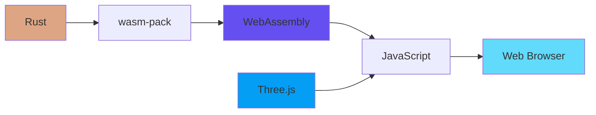

# Shut the Box - Project Wiki

Welcome to the Shut the Box project documentation! This is a 3D implementation of the classic "Shut the Box" dice game, built with a Rust/WebAssembly backend and a Three.js 3D frontend.

## Overview

Shut the Box is a traditional pub game where players roll dice and flip numbered tiles to achieve the lowest possible score. This implementation brings the game to life with realistic 3D graphics, physics-based dice rolling, and smooth animations.

**Perfect Score:** 0 (all tiles flipped down)

## Quick Links

- **[Architecture Overview](Architecture.md)** - System architecture with component diagrams
- **[Game Logic (Rust/WASM)](Game-Logic.md)** - Core game engine and state management
- **[3D Frontend (Three.js)](Frontend-3D.md)** - Rendering, animations, and user interaction
- **[Sequence Diagrams](Sequence-Diagrams.md)** - Interaction flows and game sequences
- **[Build & Development](Build-and-Development.md)** - Setup, build commands, and testing

## Technology Stack



| Component | Technology | Purpose |
|-----------|-----------|---------|
| Game Logic | Rust | Core game rules, state management, move validation |
| Build Tool | wasm-pack | Compile Rust to WebAssembly |
| 3D Graphics | Three.js | Rendering, animations, camera controls |
| Frontend | JavaScript | UI management, user interactions |
| Web Server | basic-http-server | Development server |

## Project Structure

```
shut_the_box/
├── src/
│   └── lib.rs           # Rust game logic & WASM bindings
├── www/
│   ├── index.html       # HTML structure
│   ├── main.js          # Three.js frontend
│   └── [generated]      # WASM files (auto-generated)
├── build.sh             # Build script
├── run.sh               # Development server launcher
├── Cargo.toml           # Rust dependencies
└── CLAUDE.md           # Developer guide
```

## Game Rules

1. **Starting:** All tiles (1-9) begin in the "up" position
2. **Rolling Dice:**
   - Roll **two dice** when tiles 7, 8, or 9 are still up
   - Roll **one die** when only tiles 1-6 remain
3. **Making Moves:**
   - Select tiles that sum exactly to your dice total
   - Multiple tile combinations are allowed
4. **Winning:** Flip all tiles down to achieve a score of 0
5. **Game Over:** No valid tile combinations match the dice roll

## Key Features

- **3D Isometric View**: Beautiful orthographic camera perspective
- **Realistic Dice Physics**: Tumbling animation with proper pip rendering
- **Smart Tile Selection**: Visual feedback with color changes
- **Automatic Game State**: Detects wins, game overs, and valid moves
- **Responsive Design**: Adapts to different screen sizes
- **Comprehensive Testing**: Unit tests and browser-based WASM tests

## Getting Started

```bash
# Build the project
./build.sh

# Run the game
./run.sh

# Run tests
cargo test                                    # Rust unit tests
wasm-pack test --chrome --headless           # WASM browser tests
```

## Architecture Highlights

- **State Management**: Entirely in Rust, exposed via wasm-bindgen
- **Move Validation**: Recursive combination checking algorithm
- **Rendering Pipeline**: Three.js scene graph with real-time updates
- **Communication**: Bidirectional JavaScript ↔ WASM through generated bindings

---

For detailed information about specific components, please refer to the linked pages above.
