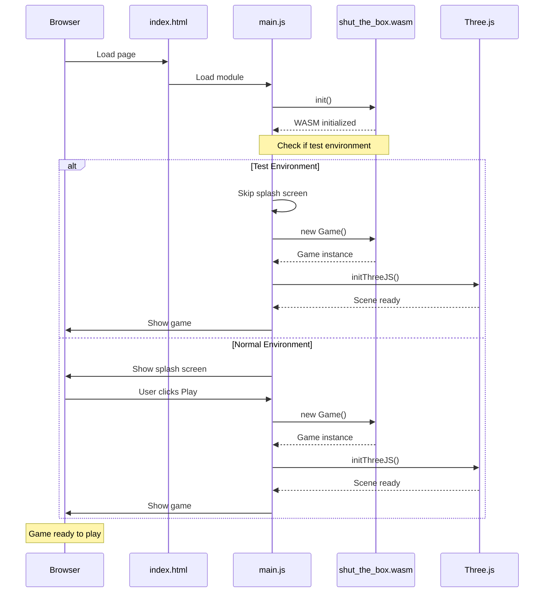
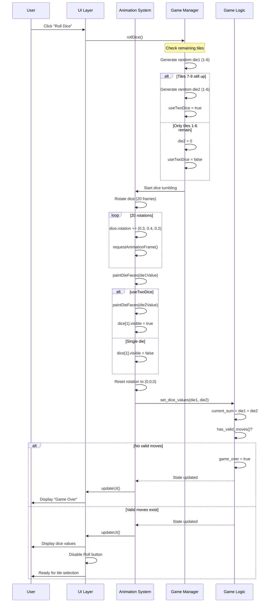
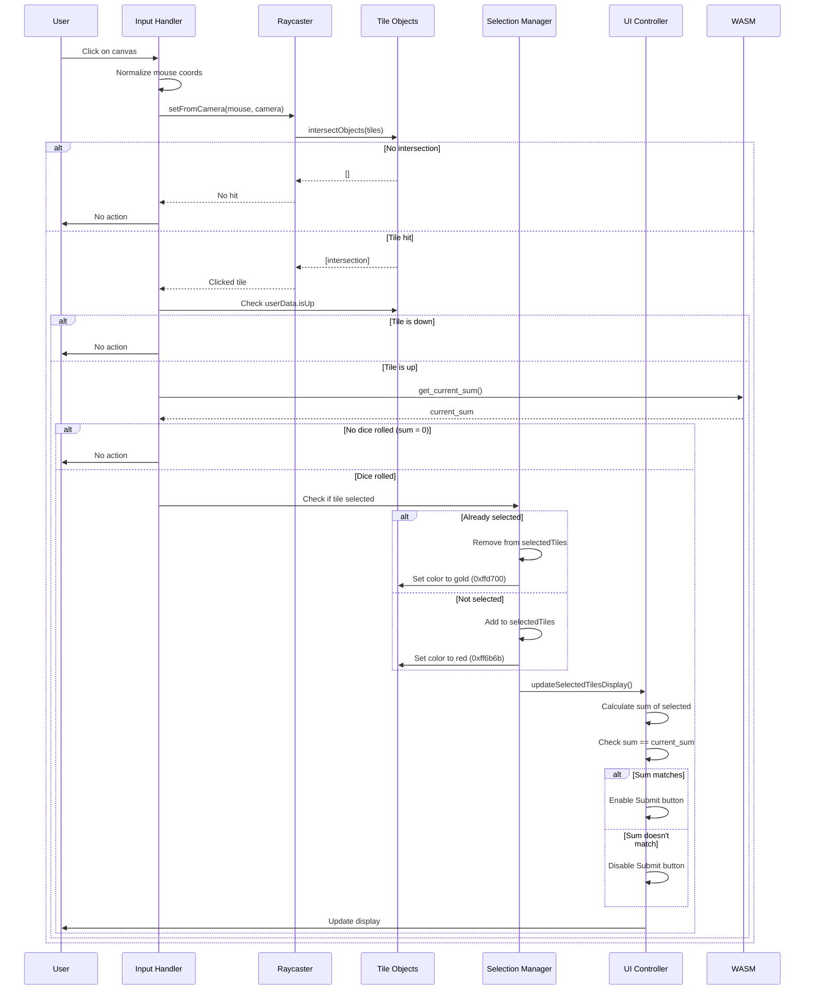
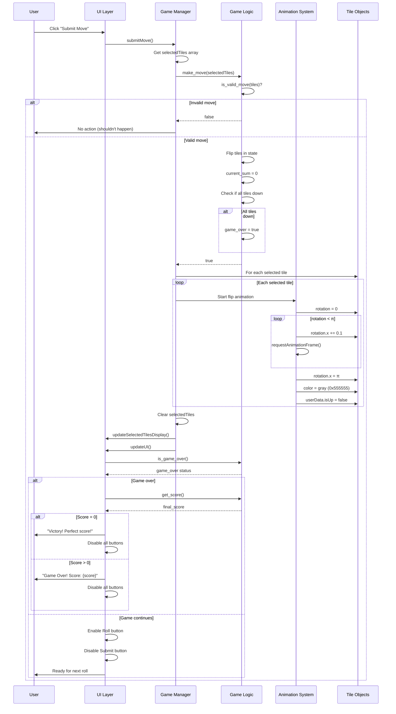
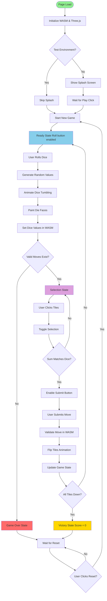
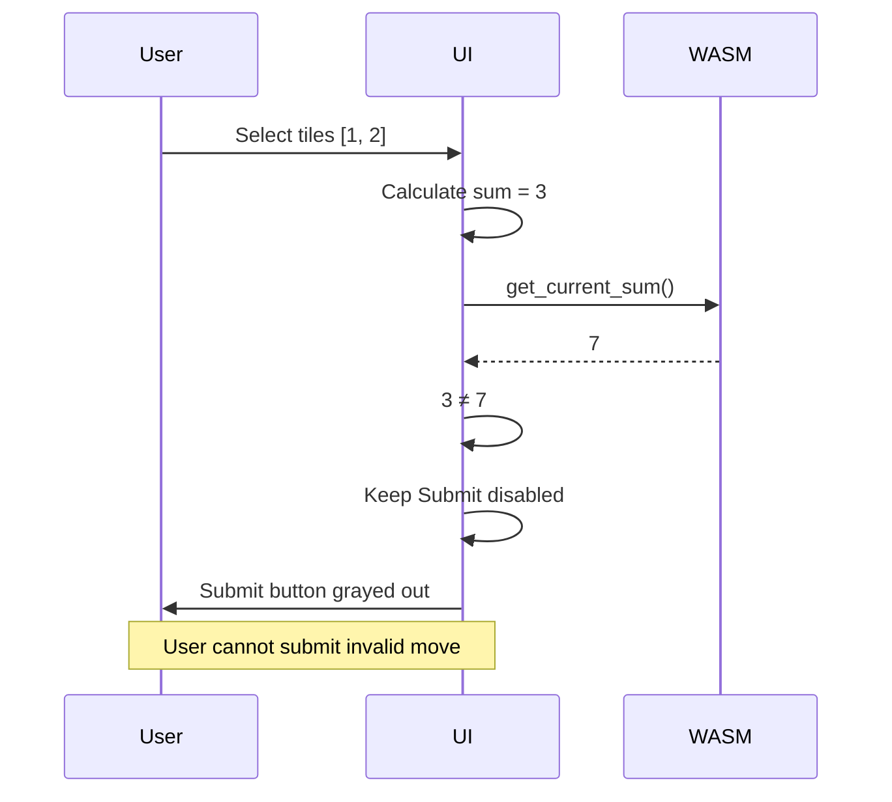
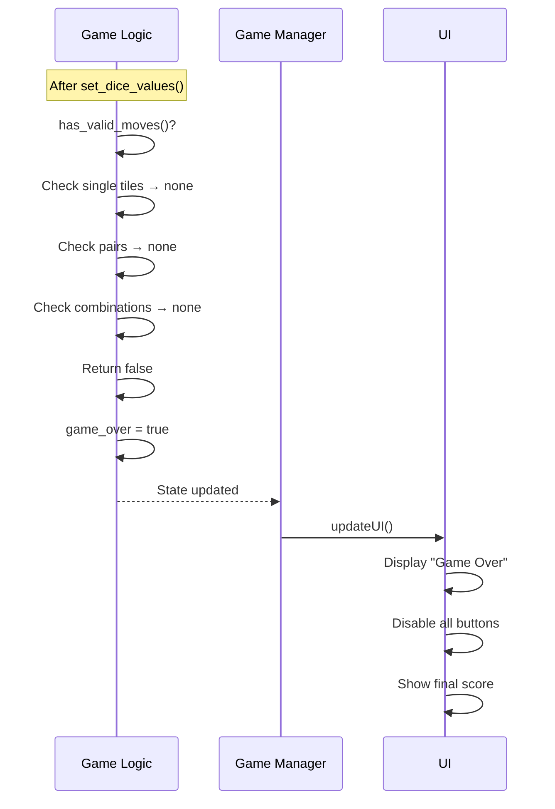

# Sequence Diagrams

This page documents the interaction flows and sequences for key operations in the Shut the Box game.

## Game Initialization



---

## Rolling Dice Sequence



---

## Tile Selection Sequence



---

## Submit Move Sequence



---

## Complete Game Flow



---

## Valid Move Detection Flow

```mermaid
flowchart TD
    START[has_valid_moves] --> CHECK_SUM{current_sum = 0?}

    CHECK_SUM -->|Yes| RETURN_TRUE[Return true No validation needed]

    CHECK_SUM -->|No| GET_TILES[Get all tiles still up]

    GET_TILES --> SINGLE[Check single tiles]

    SINGLE --> LOOP1[For each up tile]
    LOOP1 --> MATCH1{tile = sum?}
    MATCH1 -->|Yes| RETURN_TRUE
    MATCH1 -->|No| NEXT1[Next tile]
    NEXT1 --> MORE1{More tiles?}
    MORE1 -->|Yes| LOOP1
    MORE1 -->|No| PAIRS

    PAIRS[Check pairs of tiles] --> LOOP2A[For i in tiles]
    LOOP2A --> LOOP2B[For j > i in tiles]
    LOOP2B --> MATCH2{tiles[i]+tiles[j] = sum?}
    MATCH2 -->|Yes| RETURN_TRUE
    MATCH2 -->|No| NEXT2[Next pair]
    NEXT2 --> MORE2{More pairs?}
    MORE2 -->|Yes| LOOP2B
    MORE2 -->|No| COMBOS

    COMBOS[Check 3+ combinations] --> LOOP3[For size = 3 to len]
    LOOP3 --> RECURSIVE[check_combinations tiles, size, sum]

    RECURSIVE --> RECUR_CHECK{Match found?}
    RECUR_CHECK -->|Yes| RETURN_TRUE
    RECUR_CHECK -->|No| NEXT3[Next size]
    NEXT3 --> MORE3{More sizes?}
    MORE3 -->|Yes| LOOP3
    MORE3 -->|No| RETURN_FALSE[Return false No valid moves]

    style RETURN_TRUE fill:#90ee90
    style RETURN_FALSE fill:#ff6b6b
    style RECURSIVE fill:#ffd700
```

---

## Recursive Combination Checker

```mermaid
flowchart TD
    START[check_combinations tiles, size, target] --> BASE1{size = 0?}

    BASE1 -->|Yes| CHECK_TARGET{target = 0?}
    CHECK_TARGET -->|Yes| TRUE1[Return true]
    CHECK_TARGET -->|No| FALSE1[Return false]

    BASE1 -->|No| BASE2{tiles empty?}
    BASE2 -->|Yes| FALSE2[Return false]

    BASE2 -->|No| BASE3{target = 0?}
    BASE3 -->|Yes| FALSE3[Return false]

    BASE3 -->|No| INCLUDE[Try INCLUDING first tile]

    INCLUDE --> CHECK_VAL{tiles[0] ≤ target?}
    CHECK_VAL -->|Yes| RECUR1[check_combinations tiles[1..], size-1, target-tiles[0]]
    CHECK_VAL -->|No| EXCLUDE

    RECUR1 --> RESULT1{Returned true?}
    RESULT1 -->|Yes| TRUE2[Return true]
    RESULT1 -->|No| EXCLUDE

    EXCLUDE[Try EXCLUDING first tile] --> RECUR2[check_combinations tiles[1..], size, target]

    RECUR2 --> RESULT2[Return result]

    style TRUE1 fill:#90ee90
    style TRUE2 fill:#90ee90
    style FALSE1 fill:#ff6b6b
    style FALSE2 fill:#ff6b6b
    style FALSE3 fill:#ff6b6b
    style INCLUDE fill:#87ceeb
    style EXCLUDE fill:#dda0dd
```

**Example Trace:**
```
Goal: Find 3 tiles summing to 12
Tiles: [1, 2, 3, 4, 5, 6, 7, 8, 9]

check_combinations([1,2,3,4,5,6,7,8,9], 3, 12)
├─ Include 1: check_combinations([2,3,4,5,6,7,8,9], 2, 11)
│  ├─ Include 2: check_combinations([3,4,5,6,7,8,9], 1, 9)
│  │  ├─ Include 3: check_combinations([4,5,6,7,8,9], 0, 6) → false
│  │  ├─ Exclude 3: check_combinations([4,5,6,7,8,9], 1, 9)
│  │  │  ├─ Include 4: check_combinations([5,6,7,8,9], 0, 5) → false
│  │  │  ├─ Exclude 4: ...
│  │  │  │  ... eventually finds 9
│  │  │  └─ Return true (found [2, 9])
│  │  └─ Return true
│  └─ Return true (found [1, 2, 9])
└─ Return true

Result: [1, 2, 9] sums to 12 ✓
```

---

## Reset Game Sequence

```mermaid
sequenceDiagram
    participant User
    participant UI as UI Layer
    participant JS as Game Manager
    participant WASM as Game Logic
    participant Tiles as 3D Tiles

    User->>UI: Click "Reset"
    UI->>JS: resetGame()

    JS->>WASM: reset()
    WASM->>WASM: tiles = [true; 9]
    WASM->>WASM: current_sum = 0
    WASM->>WASM: dice1 = 0, dice2 = 0
    WASM->>WASM: game_over = false
    WASM-->>JS: Reset complete

    JS->>Tiles: For each tile

    loop Each tile
        Tiles->>Tiles: rotation.x = 0
        Tiles->>Tiles: color = gold (0xffd700)
        Tiles->>Tiles: userData.isUp = true
    end

    JS->>JS: Clear selectedTiles
    JS->>UI: Enable Roll button
    JS->>UI: Disable Submit button
    JS->>UI: Clear message
    JS->>UI: updateSelectedTilesDisplay()
    JS->>UI: updateUI()

    UI->>WASM: get_score()
    WASM-->>UI: 45

    UI->>User: Display "Score: 45"
    UI->>User: Game ready to play
```

---

## Error Handling Flows

### Invalid Move Attempt



### No Valid Moves



---

**Related Pages:**
- [Architecture Overview](Architecture)
- [Game Logic Details](Game-Logic)
- [Frontend Implementation](Frontend-3D)
